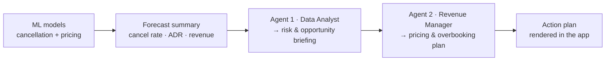

# Hotel-Booking

Hotel management system that forecasts cancellation, revenue and allocates the
correct amount of staff — served as an interactive **Streamlit** web app.

## 🚀 Live app

**Public URL:** https://hotel-booking-kwxxky4hnhdup4pn5ho5at.streamlit.app/

The app (`app.py`) predicts the probability that a hotel booking is cancelled,
using your trained scikit-learn models. It also has a data-exploration tab and a
model-inspection tab.

## 👥 Team

| Name | Roll No |
|------|---------|
| Avinash Mishra | 0409/62 |
| Anit Singh | 0012/62 |
| Dipti Bharti | 0024/62 |
| Ria Agarwal | 0133/62 |

## 📁 Project structure

```
Hotel-Booking/
├── app.py                  # Streamlit app (frontend + inference logic)
├── requirements.txt        # Libraries Streamlit Cloud installs
├── hotel_bookings.csv       # (optional) raw dataset for the EDA tab
├── .streamlit/config.toml  # Theme / server config
└── hotel_ai_models/        # Your exported models (.pkl / .joblib / .zip)
    ├── optimized_rf_cancellation.pkl
    ├── base_scaler.pkl
    └── ...
```

## ✅ What you need to add

This repo currently ships the **app scaffold only**. To make predictions, add
your exported artifacts (they weren't in the repo):

1. Put your model + scaler files in **`hotel_ai_models/`**. Loose `.pkl`,
   `.joblib`, `.sav`, or a `.zip` archive of them all work — the app
   auto-extracts zips at startup. See `hotel_ai_models/README.md` for details.
2. *(Optional)* Drop `hotel_bookings.csv` in the repo root to enable the EDA
   tab.

The app **introspects your models**: scikit-learn objects fitted on a pandas
DataFrame store `feature_names_in_`, and the app reads that to align the
sidebar inputs to the exact one-hot columns your `pd.get_dummies()` produced —
no manual column-mapping needed. Until models are present, the app runs in a
clearly-labelled demo mode instead of crashing.

## 🤖 AI Advisor (agent workflow)

The **AI Advisor** tab turns the ML predictions into a revenue action plan using
two sequential agents. The models produce a compact forecast summary, and the
agents reason over *that* — never the raw data.



- **Providers:** OpenAI · Groq · Gemini · Anthropic — pick one in the tab; supply
  the key via a local `.env` or Streamlit **Secrets** on Cloud.
- **Engine:** a built-in, dependency-free engine (default) makes the two LLM
  calls directly; ticking *Use the CrewAI framework* runs the same flow via
  CrewAI.

📄 Full pipeline + sequence diagram, agent specs, and code map:
**[`docs/agent_workflow.md`](docs/agent_workflow.md)**.

## 🖥️ Run locally

```bash
pip install -r requirements.txt
streamlit run app.py
```

A browser tab opens at http://localhost:8501.

## ☁️ Deploy on Streamlit Community Cloud

1. Push this repo to GitHub (already done for the app files).
2. Go to <https://share.streamlit.io> and sign in with GitHub.
3. **New app** → pick this repo/branch → main file path `app.py` → **Deploy**.
4. Every push to the branch auto-redeploys the app.

> **Version tip:** unpickling can break across scikit-learn major versions. If a
> `.pkl` fails to load on the cloud, pin the version you trained with in
> `requirements.txt` (e.g. `scikit-learn==1.5.1`).
