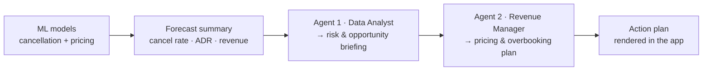

# Hotel-Booking

Hotel management system that forecasts cancellation, revenue and allocates the
correct amount of staff — served as an interactive **Streamlit** web app.

## 🚀 Live app

**Public URL:** https://hotel-booking-kwxxky4hnhdup4pn5ho5at.streamlit.app/
**YouTube link:** https://www.youtube.com/watch?v=TxzAIx7dhRA

The app (`app.py`) predicts the probability that a hotel booking is cancelled,
using your trained scikit-learn models. It also has a data-exploration tab and a
model-inspection tab.

## 📓 Model training notebook

The models were trained and exported in this Colab notebook:

[](https://colab.research.google.com/drive/1TiEW9BfZ3A6rTTnRCBU3Wo1V4pcP9YMm)

<https://colab.research.google.com/drive/1TiEW9BfZ3A6rTTnRCBU3Wo1V4pcP9YMm>

## 👥 Team

| Name | Roll No |
|------|---------|
| Avinash Mishra | 0409/62 |
| Anit Singh | 0012/62 |
| Dipti Bharti | 0024/62 |
| Ria Agarwal | 0133/62 |

## 📁 Project structure

```
Hotel-Booking/
├── app.py                  # Streamlit app (UI + inference for all tabs)
├── crew_agents.py          # AI Advisor agents + LLM engines
├── requirements.txt        # Libraries Streamlit Cloud installs
├── hotel_bookings.csv      # Full dataset for the Data & EDA tab
├── app_test_data.csv       # Held-out bookings for the Predict tab
├── .env.example            # Template for LLM API keys (copy to .env)
├── .streamlit/config.toml  # Theme / server config
├── docs/
│   └── agent_workflow.md   # AI Advisor workflow diagrams
└── hotel_ai_models/        # Trained models & scalers (.pkl)
    ├── optimized_rf_cancellation.pkl
    ├── dynamic_pricing_regressor.pkl
    ├── upsell_classifier.pkl
    ├── base_scaler.pkl
    └── ...
```

## 📦 What's included

Everything needed to run and deploy ships in the repo:

- **`hotel_ai_models/`** — the trained artifacts: cancellation classifiers
  (Random Forest, Decision Tree, Logistic Regression), a dynamic-pricing
  regressor, an upsell classifier, and their scalers.
- **`hotel_bookings.csv`** — the full dataset, powering the Data & EDA tab.
- **`app_test_data.csv`** — held-out bookings you can pick from and run
  predictions on in the Predict tab.

The app **introspects each model**: scikit-learn objects fitted on a pandas
DataFrame carry `feature_names_in_`, and the app reads that to align inputs to
the exact one-hot columns training produced — no manual column-mapping. It also
pairs each model with the right scaler (and skips scaling for tree models, which
were trained unscaled). Drop-in more models any time: loose `.pkl` / `.joblib` /
`.sav` files, or a `.zip` (auto-extracted at startup) in `hotel_ai_models/`. If
the folder is ever empty, the app runs in a labelled demo mode instead of
crashing.

## 🤖 AI Advisor (agent workflow)

The **AI Advisor** tab turns the ML predictions into a revenue action plan using
two sequential agents. The models produce a compact forecast summary, and the
agents reason over *that* — never the raw data.



- **Providers:** OpenAI · Groq · Gemini · Anthropic — pick one in the tab; supply
  the key via a local `.env` or Streamlit **Secrets** on Cloud.
- **Engine:** a built-in, dependency-free engine (default) makes the two LLM
  calls directly; ticking *Use the CrewAI framework* runs the same flow via
  CrewAI.

📄 Full pipeline + sequence diagram, agent specs, and code map:
**[`docs/agent_workflow.md`](docs/agent_workflow.md)**.

## 🖥️ Run locally

```bash
pip install -r requirements.txt
streamlit run app.py
```

A browser tab opens at http://localhost:8501.

## ☁️ Deploy on Streamlit Community Cloud

This app is already deployed — **[live here](https://hotel-booking-kwxxky4hnhdup4pn5ho5at.streamlit.app/)** —
and auto-redeploys on every push to its branch.

To spin up your own instance:

1. Go to <https://share.streamlit.io> and sign in with GitHub.
2. **Create app** → pick this repo and branch → main file path `app.py` → **Deploy**.
3. *(Optional, for the AI Advisor)* Under **Settings → Secrets**, add the key for
   your chosen provider, e.g. `OPENAI_API_KEY = "..."` or `GEMINI_API_KEY = "..."`.
   The prediction/EDA tabs work without any key.

> **Version tip:** unpickling can break across scikit-learn major versions. If a
> `.pkl` fails to load on the cloud, pin the version you trained with in
> `requirements.txt` (e.g. `scikit-learn==1.5.1`).
