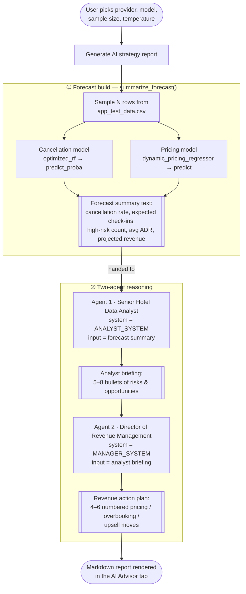
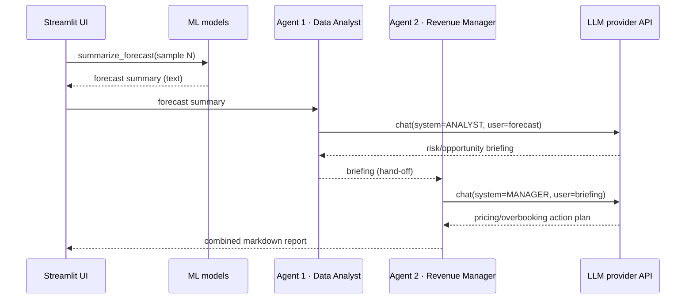

# AI Advisor — Agent Workflow

The **AI Advisor** turns the hotel's ML predictions into a business action plan
using two collaborating agents. This document extracts that workflow end to end.

- **Agent 1 — Senior Hotel Data Analyst:** reads the raw ML forecast numbers and
  writes a plain-English briefing of risks & opportunities.
- **Agent 2 — Director of Revenue Management:** takes the analyst's briefing and
  produces concrete pricing / overbooking / upsell actions.

The agents never touch the raw dataset — they reason over a compact **forecast
summary** that the ML models produce. Two interchangeable engines run the same
two-agent flow (see [Engines](#engines)).

---

## End-to-end pipeline



**Key point:** the ML models and the LLM are cleanly separated. The models turn
bookings into numbers; the agents turn numbers into decisions. The only thing
passed between them is the forecast-summary string.

---

## Agent hand-off (sequence)



The hand-off is **sequential**: Agent 2 only runs after Agent 1, and Agent 2's
input *is* Agent 1's output. No delegation, no loops.

---

## Agent specifications

| | Agent 1 | Agent 2 |
|---|---|---|
| **Role** | Senior Hotel Data Analyst | Director of Revenue Management |
| **Goal** | Analyze the weekly ML forecast; surface operational risks & opportunities | Maximize revenue via pricing & overbooking decisions |
| **Backstory** | Expert at translating ML probabilities into plain-English business insight | A ruthless optimizer who turns analysis into concrete pricing actions |
| **Input** | Forecast summary (from the ML models) | Agent 1's briefing |
| **Output** | 5–8 bullet briefing, each tied to a figure | 4–6 numbered actions (move + trigger + expected impact) |
| **Delegation** | none | none |

---

## CrewAI definitions (Agent · Task · Crew)

The canonical CrewAI setup, as defined in `crew_agents.py`
(`build_agents()` / `build_crew()`):

```python
from crewai import Agent, Task, Crew, Process, LLM

# Shared LLM (any provider via LiteLLM), with temperature control.
llm = LLM(model="gemini/gemini-3.5-flash-lite", temperature=0.3)

# --- Agents -------------------------------------------------------------
data_analyst = Agent(
    role="Senior Hotel Data Analyst",
    goal="Analyze weekly ML occupancy forecasts and identify operational "
         "risks or opportunities.",
    backstory="You are an expert at translating raw machine learning "
              "probabilities into plain English business insights.",
    llm=llm,
    verbose=True,
    allow_delegation=False,
)

revenue_manager = Agent(
    role="Director of Revenue Management",
    goal="Maximize revenue by adjusting pricing and overbooking strategies "
         "based on data.",
    backstory="You are a ruthless optimizer. You take data analyst reports "
              "and create concrete pricing actions.",
    llm=llm,
    verbose=True,
    allow_delegation=False,
)

# --- Tasks --------------------------------------------------------------
analysis_task = Task(
    description=f"Here is this week's ML-generated hotel booking forecast:\n\n"
                f"{forecast_context}\n\n"
                "Analyze it. Identify the key operational risks (e.g. high "
                "cancellation exposure, low occupancy) and opportunities "
                "(e.g. upsell potential, pricing headroom). Be specific and "
                "reference the numbers.",
    expected_output="A concise bullet-point briefing (5-8 bullets) of the most "
                    "important operational risks and opportunities, each tied "
                    "to a figure from the forecast.",
    agent=data_analyst,
)

strategy_task = Task(
    description="Using the analyst's briefing, create a concrete action plan "
                "to maximize revenue this week. Cover pricing moves "
                "(raise/hold/discount and by roughly how much), overbooking "
                "levels given the cancellation forecast, and any targeted "
                "upsell pushes.",
    expected_output="A numbered action plan (4-6 items). Each item states a "
                    "specific move, the trigger from the data, and the expected "
                    "revenue impact.",
    agent=revenue_manager,
    context=[analysis_task],   # <-- receives the analyst's output
)

# --- Crew ---------------------------------------------------------------
crew = Crew(
    agents=[data_analyst, revenue_manager],
    tasks=[analysis_task, strategy_task],
    process=Process.sequential,   # analyst runs first, then revenue manager
    verbose=True,
)

result = crew.kickoff()   # -> final revenue action plan
```

- **2 Agents** — Data Analyst and Revenue Manager (no delegation).
- **2 Tasks** — `analysis_task` (analyst) and `strategy_task` (revenue manager);
  `strategy_task.context=[analysis_task]` passes the analyst's output forward.
- **1 Crew** — sequential process, so the tasks run in order.

## Data contract — the forecast summary

`summarize_forecast()` runs the models over a sample of bookings and emits text
like this, which is the sole input to Agent 1:

```
Sample size: 50 upcoming bookings.
Cancellation model: optimized_rf_cancellation
Predicted cancellation rate: 42.5%
Expected check-ins: 29 of 50
High-risk bookings (>70% cancel prob): 15
Pricing model: dynamic_pricing_regressor
Average predicted ADR: 97.24
ADR range: 30.91 - 199.18
Projected room revenue (ADR sum): 4,860
```

---

## Engines

Both engines run the **identical** two-agent flow above; only the plumbing
differs. The engine is chosen with the *"Use the CrewAI framework"* checkbox.

```mermaid
flowchart LR
    F[Forecast summary] --> SW{Engine}
    SW -->|default| L[Built-in engine<br/>run_advisor_lite&#40;&#41;<br/>direct REST calls · stdlib only]
    SW -->|opt-in| CW[CrewAI engine<br/>run_advisor&#40;&#41;<br/>Crew · sequential Tasks]
    L --> RPT[Report]
    CW --> RPT
```



| | Built-in engine (default) | CrewAI engine (optional) |
|---|---|---|
| Function | `run_advisor_lite()` | `run_advisor()` → `build_crew()` |
| Mechanism | Two direct REST calls (`chat_once`) | `Crew` with two sequential `Task`s |
| Dependencies | Python stdlib only | `crewai` + `chromadb` + `litellm` … |
| Deploys on Streamlit Cloud | ✅ reliably | ⚠️ heavy; needs pinned versions |
| Providers | OpenAI · Groq · Gemini · Anthropic | via LiteLLM |

The built-in engine exists because CrewAI's dependency stack is fragile on
Streamlit Cloud; it reproduces the same personas and hand-off without the weight.

---

## Where it lives in the code

| Piece | Location |
|---|---|
| Forecast builder | `app.py` → `summarize_forecast()` |
| Agent personas | `crew_agents.py` → `ANALYST_SYSTEM`, `MANAGER_SYSTEM` |
| Built-in engine | `crew_agents.py` → `chat_once()`, `run_advisor_lite()` |
| CrewAI engine | `crew_agents.py` → `build_agents()`, `build_crew()`, `run_advisor()` |
| Providers & keys | `crew_agents.py` → `PROVIDERS`, `env_var_for()` |
| UI / orchestration | `app.py` → **AI Advisor** tab |
